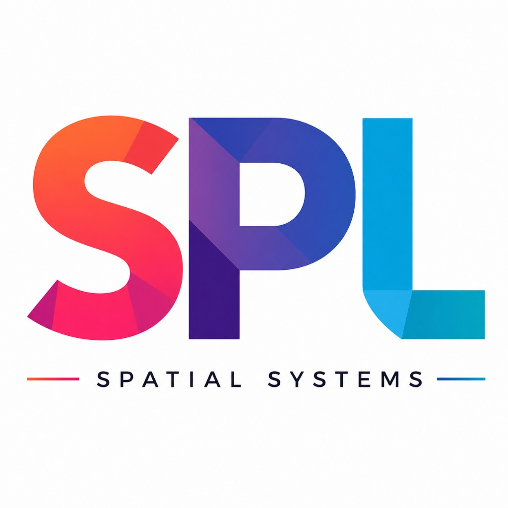
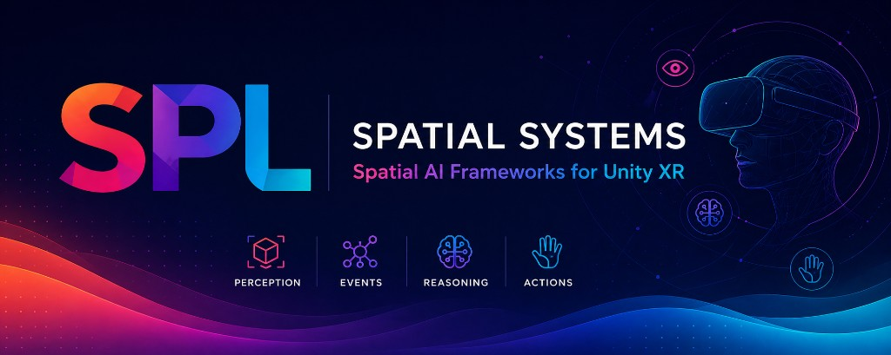

# XRCore Ecosystem

<p align="center">
  
</p>

<p align="center">
  
</p>

[](https://unity.com/)
[](https://github.com/splibiplay?tab=repositories)
[](https://github.com/splibiplay?tab=repositories)
[](https://github.com/splibiplay/xrcore-sdk)
[](https://github.com/splibiplay)
[](https://github.com/splibiplay/xrcore-sdk/blob/main/LICENSE)

## Modular AI Agent Framework for Unity XR

Build intelligent XR assistants, guided training systems, and enterprise-ready assessment workflows using a scalable event-driven architecture.

XRCore connects:

`Perception -> Events -> Reasoning -> Actions`

## Product Suite

### XRCore SDK
Free foundation framework for AI-driven XR agents.  
Repository: [xrcore-sdk](https://github.com/splibiplay/xrcore-sdk)

### XRCore Training Toolkit
Guided XR training workflows with reusable validators and feedback systems.  
Repository: [xrcore-training-toolkit](https://github.com/splibiplay/xrcore-training-toolkit)

### XRCore Training Assessment
Scoring, pass/fail logic, critical failure detection, and exportable reports for measurable XR training.  
Repository: [xrcore-assessment](https://github.com/splibiplay/xrcore-assessment)

### Coming Next
- XRCore Training Authoring
- XRCore Voice Instructor
- XRCore Vision Pack

## Visual Roadmap

```text
XRCore SDK
   ↓
Training Toolkit
   ↓
Training Assessment
   ↓
Training Authoring
   ↓
Voice + Vision + Analytics
```

## Demo Videos

- SDK demo: [XRCore SDK Demo](https://github.com/splibiplay/xrcore-sdk/raw/main/XRCore_Demo.mp4)
- Training Toolkit demo: [XRCore Training Toolkit Demo](https://www.youtube.com/watch?v=NmwTmtryts8&list=PLdX4Fo1P__hpMhe5PJsSRt3a8O02E0dr3&index=2)
- Training Assessment demo: [XRCore Training Assessment Demo](https://youtu.be/MpAfoV2tRJY)

## Links

- Asset Store Publisher Page: [Unity Asset Store Publishers](https://assetstore.unity.com/publishers)
- YouTube Demos:
  - [Training Toolkit Demo](https://www.youtube.com/watch?v=NmwTmtryts8&list=PLdX4Fo1P__hpMhe5PJsSRt3a8O02E0dr3&index=2)
  - [Training Assessment Demo](https://youtu.be/MpAfoV2tRJY)
- Official Repositories:
  - [xrcore-sdk](https://github.com/splibiplay/xrcore-sdk)
  - [xrcore-training-toolkit](https://github.com/splibiplay/xrcore-training-toolkit)
  - [xrcore-assessment](https://github.com/splibiplay/xrcore-assessment)

---

SPL Spatial Systems is building an official product ecosystem for guided XR training and measurable assessment in Unity.
